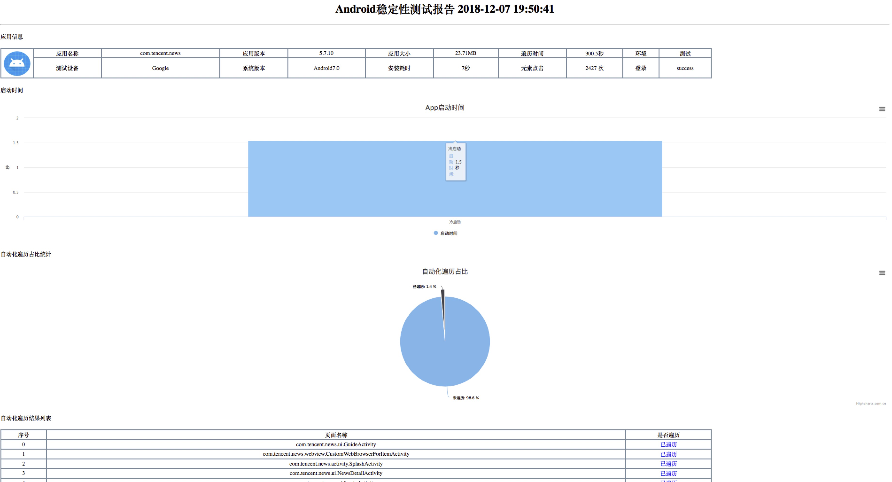
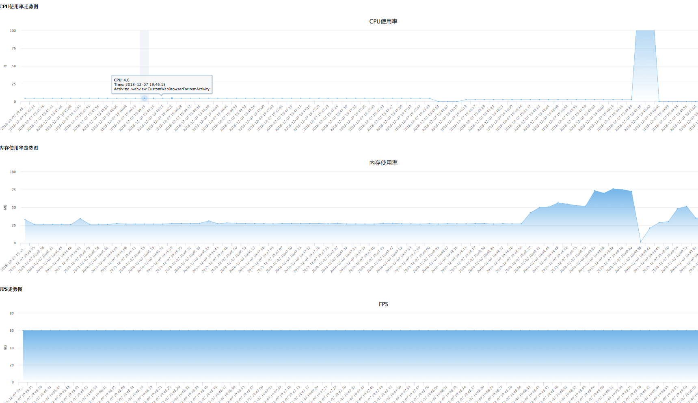
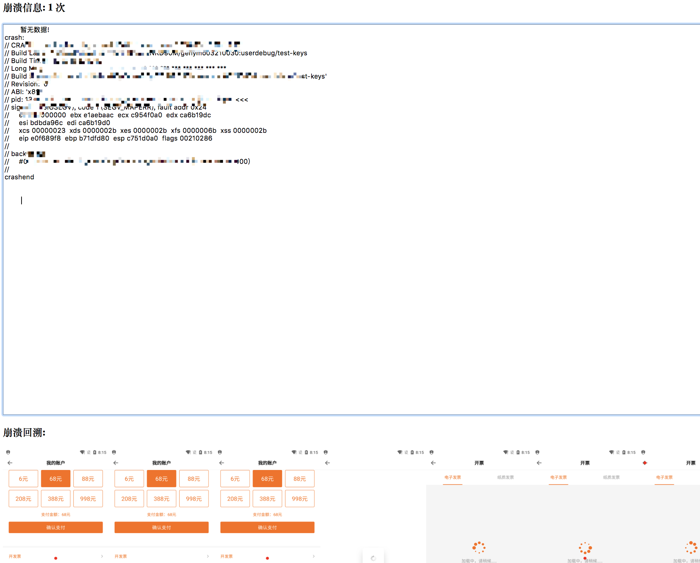

# 简介

使用前请阅读https://testerhome.com/topics/16909<br>

使用开源工具Maxim进行Monkey测试,包含如下功能:<br>
1.安装测试<br>
2.启动测试<br>
3.登录测试<br>
4.Monkey测试<br>
5.性能数据统计<br>
6.崩溃日志及崩溃回溯图片<br>

# 更新日志

## 12月29日
1.修改崩溃图片查询方式<br>
2.新增apk包检查功能<br>

使用命令如下:
```angularjs
cd checker
python run.py apk_path mail_list(多个人逗号分隔)
```


# 登录测试
需要在lanuchtest/lanuchapp.py实现登录测试,
使用appium进行元素定位即可
```
可以By.xpath、By.id,后面写元素的值.

self.driver.find_element(By.XPATH,self.sure).click()
```


# 环境依赖
1.adb环境<br>
brew install adb<br>
2.appium环境<br>
npm install appium<br>
3.python库<br>
在根目录,执行python setup.py会安装有python需要的库


# 邮件
```angular2html
需要在report/mailconfig.py中配置发件人相关信息

# 设置服务器，用户名、口令以及邮箱的后缀
mail_host = "smtp.exmail.qq.com"
mail_user = "xxxxx@xxxxx.com"
mail_pass = "xxxxx"
mail_postfix = "xxxxxx"

```


# 运行
```
cd到根目录下

apk_path:本地apk路径
device_name:设备号,使用adb devices查看
run_time:运行时间,单位分钟
mail_list:报告邮件人,多人用逗号分隔

python run.py apk_path device_name run_time mail_list

```

# 本地调试
```
python main.py max --config_path /Users/xinxi/PycharmProjects/maxauto/config/config.yaml
```

# 运行
```angularjs
max --config_path /Users/xinxi/PycharmProjects/maxauto/config/config.yaml
```

# 打包

建立setup.py
python setup.py bdist_egg

# 发布
创建~.pypirc文件
```angularjs
[distutils]
index-servers = pypi

[pypi]
username:你的PyPi用户名
password:你的PyPi密码
```


# 安装上传功能
```
pip install twine
```

# 发布
twine upload dist/*


# 报告
在report/reports目录下生成,效果展示如下






